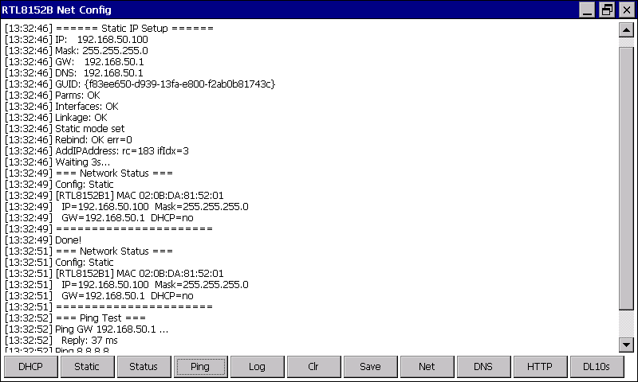

# RTL8152B USB Ethernet Driver for WinCE 7.0

Author: SweatierUnicorn  
GitHub: https://github.com/SweatierUnicorn
This code is distributed by the author free of charge.

## Overview

This repository contains a working WinCE/WEC7 USB Ethernet solution for the Realtek RTL8152B:

- `rtl8152.dll`: NDIS 5.1 miniport + USB client driver
- `NetConfig.exe`: small network configuration and diagnostic tool

Supported target chip:

- Realtek RTL8152B
- USB VID: `0x0BDA`
- USB PID: `0x8152`

## Target System

This build was developed and tested for one specific target system:

- Panasonic Strada CN-F1X10BD
- WinCE 7.0 / WEC7 Automotive
- Renesas R-Mobile A1 / R8A77400 based platform
- Realtek RTL8152B USB Ethernet adapter

It works on this system in its current form.

## Important Note

This repository reflects a build tuned for my own device and BSP.

If you want to use it on another WinCE device, board, or BSP, you may need to adjust:

- registry paths and adapter binding
- USB client loading path
- static IP or DHCP defaults
- EHCI / USB routing details
- post-link patching or deployment details

In other words, the code is reusable, but another device may require small source or registry changes.

## Repository Contents

- `rtl8152.c`, `rtl8152.h`, `rtl8152.def`: driver source files
- `NetConfig.c`: helper tool source
- `compile_rtl8152.bat`: driver build script
- `compile_netconfig.bat`: NetConfig build script
- `LICENSE`: license and redistribution note

## Main Files

- `rtl8152.c`
- `rtl8152.h`
- `rtl8152.def`
- `NetConfig.c`
- `compile_rtl8152.bat`
- `compile_netconfig.bat`

## Build Environment Used

The code was built and maintained with the following tools:

- Visual Studio Code as the editor/workspace
- Microsoft Visual Studio 2008
- Windows CE ARM toolchain
- Toradex CE700 SDK
- Python for the post-link PE patch step

## Build Notes

- `compile_rtl8152.bat` optionally uses `panasonic_pe_patcher.py` if it is placed next to the script.
- If the patcher is not present, the script still completes and skips that optional step.
- Deployment and registry integration may differ on other BSPs.

## Notes

- This repository is intended for source distribution.
- Old builds and local binary artifacts are not required for publication.
- `panasonic_pe_patcher.py` is expected by the build script and should be available separately if you want to reproduce the same DLL build process.

## Publishing

See `GITHUB_PUBLISH.txt` for a short example of how to initialize and publish this folder as a GitHub repository.
